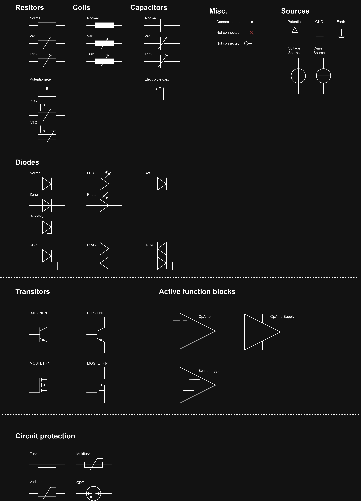

# DrawIO_Electronics
- This is a simple library for electronics components. Because the included library is trash.
- Symbols are drawn according to **IEC** norm. US symbols are trash. Look at the resistor symbol wtf is this.

## Preview

## Notes
The library is drawn in a grid of **2pt**